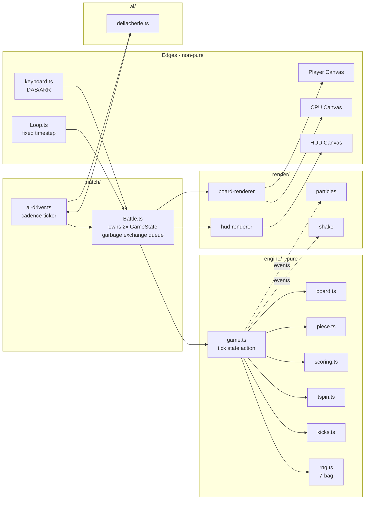

# Implementation Plan — Tetris Battle (`tetris-battle/`)

## Problem Statement

Build a browser-based Tetris Battle game (1 human vs. heuristic AI, side-by-side boards with garbage exchange) in a new `tetris-battle/` directory under the repo root. The project serves **two purposes**:

1. **A real, playable, polished MVP** — modern guideline-faithful Tetris with a competent CPU opponent, KO win condition, and visual juice.
2. **An LLM coding benchmark artifact** — the *primary* deliverable. After we build the reference, we capture the spec as a single `TETRIS_BATTLE_MASTER_PROMPT.md` so future LLMs can attempt the same build from scratch and be graded against this reference.

Every decision recorded in this plan (stack pins, file layout, algorithm choices, scoring tables, failure modes) becomes part of the master prompt so a future agent session reproduces the same project deterministically.

Reference precedent inside this repo: `dog-tinder/README.md` already establishes the LLM-benchmark-artifact pattern (master prompt + reference build + explicit failure-mode checklist). This project copies that pattern.

## Requirements (locked)

**Game scope**
- 1 human vs. 1 CPU, side-by-side 10×20 playfields, browser only.
- Modern Tetris guideline-faithful: SRS rotation + full SRS wall-kick tables (including I-piece kicks), 7-bag randomizer, hold piece (one swap per lock), ghost piece, hard drop, soft drop, lock delay (500 ms with 15-move reset cap), DAS 167 ms / ARR 33 ms.
- Scoring: Single 100, Double 300, Triple 500, Tetris 800, T-Spin Mini 100, T-Spin Single 800, T-Spin Double 1200, T-Spin Triple 1600. B2B multiplier ×1.5 on consecutive Tetrises/T-Spins. Combo bonus 50 × combo × level. Soft drop 1/cell, hard drop 2/cell. Level up every 10 lines; gravity follows the guideline table up to level 20.
- T-Spin detection by 3-corner rule (3 of the 4 cells diagonally adjacent to T's center are filled), Mini if the two front-corners aren't both filled and the rotation wasn't a kick that filled them.
- Garbage send table: Single=0, Double=1, Triple=2, Tetris=4, TSM=0, TSS=2, TSD=4, TST=6. B2B +1. Combo bonus per chain (0,0,1,1,2,2,3,3,4,4,4,5...). Perfect Clear +10. Incoming garbage offsets outgoing 1-for-1 (cancel queue). Garbage rises with one random hole column, stable for ≥2 lines (Tetris-style: hole column persists for runs of same garbage event).
- AI: Dellacherie 4-feature heuristic. Evaluates every (rotation × column) placement of the current piece against weights `aggregateHeight: -0.510066, completeLines: +0.760666, holes: -0.35663, bumpiness: -0.184483`. Picks best terminal placement, performs it as instant placement (no animated travel — appears at chosen cell next tick). Cadence: 1 piece per `1200ms − 60ms × min(level, 15)` (floor 300 ms).
- Match: First top-out loses. Single round (no best-of). Rematch button after KO.

**Tech stack (LOCKED — record verbatim in master prompt)**
- Node 20.x, package manager `npm`.
- Vite 6.x, TypeScript 5.x, target ES2022, strict mode on.
- **No** UI framework, **no** game engine, **no** CSS framework. Plain TS modules + Canvas2D + a single `styles.css`.
- Dev deps: `vite`, `typescript`, `vitest` (logic tests), `@types/node`. That's it.
- Output: static `dist/` deployable to any static host.

**Folder layout (LOCKED)**
```
tetris-battle/
├── PLAN.md                            # this plan, written in Task 0
├── index.html
├── package.json
├── tsconfig.json
├── vite.config.ts
├── vitest.config.ts
├── README.md                          # human-facing + grading checklist (Task 13)
├── TETRIS_BATTLE_MASTER_PROMPT.md     # the benchmark prompt (Task 13)
├── public/
│   └── favicon.svg
└── src/
    ├── main.ts                        # bootstrap, mounts the App
    ├── styles.css                     # full stylesheet (CSS-vars-driven theme)
    ├── app/
    │   ├── App.ts                     # screen state machine: title → countdown → playing → result
    │   └── Loop.ts                    # fixed-timestep RAF loop
    ├── engine/                        # pure, deterministic, no-DOM logic
    │   ├── types.ts                   # Cell, PieceKind, Rotation, GameEvent, etc.
    │   ├── tetrominoes.ts             # shape data + colors
    │   ├── kicks.ts                   # SRS wall-kick tables (incl. I-piece)
    │   ├── rng.ts                     # seedable Mulberry32 + 7-bag generator
    │   ├── board.ts                   # collisions, line scan, garbage rise
    │   ├── piece.ts                   # active piece state + rotation
    │   ├── scoring.ts                 # score table, B2B, combo, garbage send table
    │   ├── tspin.ts                   # 3-corner detection
    │   └── game.ts                    # GameState reducer + tick(action)
    ├── ai/
    │   └── dellacherie.ts             # board-evaluation heuristic + best-move search
    ├── render/
    │   ├── board-renderer.ts          # canvas draw of one board (player or CPU)
    │   ├── hud-renderer.ts            # score, level, lines, next×5, hold, incoming bar
    │   ├── particles.ts               # line-clear burst system
    │   ├── shake.ts                   # screen-shake helper
    │   └── theme.ts                   # color palette per piece + background
    ├── input/
    │   └── keyboard.ts                # DAS/ARR keyboard controller
    └── match/
        ├── Battle.ts                  # owns two GameState instances + garbage exchange
        └── ai-driver.ts               # ticks AI cadence, feeds actions into CPU GameState
└── tests/
    ├── board.test.ts
    ├── piece.test.ts
    ├── kicks.test.ts
    ├── rng.test.ts
    ├── scoring.test.ts
    ├── tspin.test.ts
    └── ai.test.ts
```

**Controls (LOCKED)**
- ← / → move, ↓ soft drop, ↑ rotate CW, `Z` rotate CCW, `X` rotate CW (alt), `Space` hard drop, `C` / `Shift` hold, `P` / `Esc` pause, `R` rematch on result screen, `?` toggle controls overlay.
- DAS 167 ms, ARR 33 ms. Soft-drop multiplier ×20.

**Determinism / benchmarking surface**
- All randomness goes through one seeded `Mulberry32` RNG; player and CPU each get an independent stream derived from the match seed. Match seed shown in HUD ("seed: 0xABCDEF12") so a run can be reproduced. Overridable via `?seed=` query string.
- Game logic is pure (`tick(state, action) → state`); rendering and input are at the edges. Logic is unit-tested with Vitest.

## Background

Findings that informed the design (no external research needed at build time — all rules are public Tetris Guideline + well-documented community resources):

- **SRS kicks** — published in the Tetris Guideline; J/L/S/T/Z share one kick table, I has its own, O doesn't kick. Failure mode: many LLMs implement only basic rotation without kicks, causing T-spin setups to be impossible and rotations near walls to fail. Master prompt must include the full table verbatim.
- **Lock delay** — 500 ms with a 15-move reset cap is the modern standard. LLMs commonly implement either no lock delay (piece locks the moment it touches floor) or unlimited reset (infinity), both of which feel wrong. Both failure modes will be in the prompt's "do not do this" list.
- **7-bag** — produces every 7-piece permutation; LLMs frequently substitute `Math.random() % 7` which causes piece droughts. Easy to detect by inspecting the next queue.
- **T-spin detection** — 3-corner rule + last-action-was-rotation. LLMs often skip this entirely or implement only T-Spin Double, missing TSM and TST. Tests will assert all 4 variants.
- **Dellacherie heuristic** — Pierre Dellacherie's 1996 4-feature evaluation function, weights as given above. Reference algorithm for the AI; deterministic and easy to validate.
- **Garbage cancellation** — guideline rule that incoming garbage offsets your outgoing send before it materializes. Easy to skip; results in pile-up.

## Proposed Solution — Architecture



Fixed-timestep loop runs at 60 Hz. `Battle` owns two `GameState` instances. Each frame: drain input → step player state → step AI driver (which may push an action into CPU state) → resolve garbage exchange → emit events → render. Game logic is fully pure: `tick(state, action) → { state, events }`. Events drive both garbage exchange and visual effects (particles/shake/toasts).

## Task Breakdown

Each task ends with a working, demoable increment. TDD where logic warrants it. No orphaned code — every module added is wired before the task is considered done. Tasks are executed in order; do not start a task until the previous one's demo passes.

---

**Task 0: Create directory and write `PLAN.md`**

Objective: Before any code, capture this entire plan to disk so a future agent session can pick up from a known state even if execution stalls.

Implementation guidance:
- Create directory `tetris-battle/` at the repo root.
- Write `tetris-battle/PLAN.md` containing the full text of this plan.
- Do not yet run `npm init` or create any other files.

Demo: `tetris-battle/PLAN.md` exists and contains the full plan including the mermaid architecture diagram.

---

**Task 1: Project scaffold + dual-canvas shell**

Objective: Get a runnable Vite + TS project with the locked file layout and a black page that contains two empty playfield canvases plus an HUD area, sized correctly.

Implementation guidance:
- Pin versions in `package.json`: `vite ^6.0.0`, `typescript ^5.6.0`, `vitest ^2.0.0`, `@types/node ^20.0.0`. `"engines": { "node": ">=20" }`. No other deps.
- Scripts: `dev`, `build`, `preview`, `test` (= `vitest`).
- `tsconfig.json`: `strict: true`, `noUncheckedIndexedAccess: true`, `target: ES2022`, `moduleResolution: bundler`, `lib: ["ES2022", "DOM"]`.
- Stub files for every path in the locked folder layout, each tagged with `// TODO: Task N`.
- `index.html` lays out: `<canvas id="player">`, `<canvas id="cpu">`, `<div id="hud">`. Cell size 28 px → board canvas 280×560 plus 4 px gutter. Title "Tetris Battle".
- `styles.css`: dark background `#0b0d12`, monospace font stack, CSS vars for piece colors (cyan `#22d3ee`, yellow `#eab308`, purple `#a855f7`, green `#22c55e`, red `#ef4444`, blue `#3b82f6`, orange `#f97316`).
- `Loop.ts` runs a fixed 16.667 ms accumulator loop with `requestAnimationFrame`. `main.ts` wires the loop and a placeholder render that fills both canvases black with a 1px grid and writes the frame number to the HUD.
- `public/favicon.svg`: simple stacked-block tetromino icon.

Demo: `npm run dev` opens a localhost page showing two empty bordered playfield areas with labels "YOU" and "CPU" and a frame counter in the HUD that ticks every frame. `npm run build` produces a working `dist/`.

---

**Task 2: Board + tetromino model + SRS kicks (pure logic + tests)**

Objective: Implement immutable engine primitives — board grid, tetromino shape data, rotation states, SRS wall-kick lookup, collision detection — with full unit-test coverage.

- `engine/types.ts`: `Cell = 0 | PieceKind`, `PieceKind = 'I'|'O'|'T'|'S'|'Z'|'J'|'L'`, `Rotation = 0|1|2|3`, `Piece = { kind, rot, x, y }`.
- `engine/tetrominoes.ts`: 4 rotation states per piece as `[dx,dy][]`. Spawn orientations match guideline.
- `engine/kicks.ts`: `KICKS_JLSTZ` and `KICKS_I`, exact guideline values. O-piece `[[0,0]]`.
- `engine/board.ts`: `createBoard()` (40 rows × 10 cols, top half is buffer). `collides`, `merge`, `clearLines`, `addGarbage`.
- `engine/piece.ts`: `tryRotate(board, piece, dir)` returns `{ piece, kickIndex } | null`.
- Wire a static T-piece into the placeholder renderer to prove engine state is read end-to-end.

Tests:
- `kicks.test.ts`: TSD setup, rotate-left at right column → kick `[1,2]` succeeds.
- `board.test.ts`: line clear with 4 → Tetris; garbage rise with hole column.
- `piece.test.ts`: I-piece in 4-wide well rotates via I-kick; right-wall rotation kicks left.

Demo: `npm test` green; static T-piece rendered on player board.

---

**Task 3: Seedable RNG + 7-bag piece queue + next/hold HUD slots**

Objective: Deterministic randomness end-to-end. Two independent piece streams (player, CPU) derived from one match seed. HUD shows next-5 preview and an empty hold slot.

- `engine/rng.ts`: `mulberry32(seed)`, `splitSeed(seed)`, `createBag(rng)` Fisher-Yates 7-bag.
- `engine/game.ts`: `GameState` with `queue` (≥5), `hold`, `holdUsed`, `seed`.
- HUD renderer draws next-5 panel (4×4 mini previews) and hold panel.
- Display "seed: 0xXXXXXXXX". Parse `?seed=0xXXXXXXXX` from URL.

Tests: same seed → same outputs; bag of 7 has all kinds; split streams differ.

Demo: refresh with `?seed=0xCAFEBABE` produces same pieces every time.

---

**Task 4: Player input + gravity + soft drop + lock delay**

- `input/keyboard.ts`: DAS 167 / ARR 33, soft drop multiplier ×20, emits actions per frame.
- `engine/game.ts`: gravity table per level; lock delay 500 ms, 15-move reset cap.
- Spawn at column 4, row 19. Spawn collision → `topOut` flag.

Tests: 16 successful moves still locks; soft drop awards 1/cell.

Demo: human plays single board, pieces stack; CPU still static.

---

**Task 5: Hard drop + hold piece + ghost piece**

- Hard drop: instant lock, score += 2 × distance.
- Hold: one swap per lock cycle; reset on each new spawn.
- Ghost: outline at landing position, alpha 0.25.

Tests: hold cannot be used twice consecutively; ghost equals hard-drop landing.

Demo: full single-board feel — drops, holds, ghost preview.

---

**Task 6: Line clear + scoring + level/gravity progression**

- `engine/scoring.ts`: pure `scoreClear` per the locked tables.
- 120 ms white flash on cleared rows then 60 ms collapse ease.
- HUD shows score/level/lines.

Tests: Single→100, Tetris→800, B2B Tetris→1200, combo of 5 at level 3 → +750.

Demo: clears advance score and level; gravity speeds up.

---

**Task 7: T-Spin / B2B / Combo detection + scoring text toasts**

- `engine/tspin.ts`: 3-corner rule + last-action-rotation; returns `null | 'mini' | 'normal'`.
- Track `b2b: boolean` and `combo: number`.
- Toast text floats up 20 px and fades over 800 ms.

Tests: TSD → 'normal' + 1200; mini setup → 'mini'; non-rotation lock → null.

Demo: T-spin pop-ups, persistent B2B indicator.

---

**Task 8: Top-out + game-over flow (single-board)**

- Spawn collision OR lock entirely above row 20 → top-out.
- Dim board, GAME OVER overlay, `R` restart same seed.

Demo: stack to top → overlay → R → reset to same queue.

---

**Task 9: CPU board engine + Dellacherie AI**

- `match/Battle.ts`: owns two `GameState`s.
- `ai/dellacherie.ts`: enumerate (rotation 0..3) × (column −2..11), score = `−0.510066·H + 0.760666·L − 0.35663·holes − 0.184483·bumpiness`. Tiebreak by lower column.
- `match/ai-driver.ts`: cadence `max(300, 1200 − 60·min(level,15))` ms; performs `setRotation` + `setColumn` + `HardDrop` in one tick.
- AI does not use hold for MVP.

Tests: flat board + I-piece → leftmost horizontal placement; one-column board → avoid creating holes.

Demo: CPU plays autonomously alongside player.

---

**Task 10: Garbage exchange system**

- `Battle` keeps two FIFO incoming queues.
- On clear: cancel pending incoming first, send surplus to opponent.
- Materialize pending garbage on next non-clearing lock; one hole column per *event*.
- HUD incoming bar; pulse when ≥4.

Tests: B2B Tetris → 5 sent; cancellation: 2 incoming + 4 send → 0 in / 2 out.

Demo: clears send garbage to CPU and vice versa, with cancellation.

---

**Task 11: Match shell — title, countdown, KO, rematch, pause, controls overlay**

- `app/App.ts`: `Screen = 'title' | 'countdown' | 'playing' | 'paused' | 'result'`.
- Title: logo, ENTER to start, `S` reroll seed, `?` controls.
- Countdown 3-2-1-GO at 700 ms each.
- Result: stats, `R` rematch (same seed), `T` new seed.
- Pause via `P`/`Esc`.

Tests: state-machine transitions.

Demo: complete user-facing flow.

---

**Task 12: Polish pass — particles, shake, warning flash, KO splash, responsive**

- Particles: 8 per cleared cell, gravity 600 px/s², 600 ms lifetime, additive blend.
- Shake: Tetris 6 px/200 ms; T-Spin 8 px/250 ms; KO 16 px/500 ms.
- Garbage warning: pulse at 4 Hz when incoming ≥ 4.
- KO splash: 200 ms freeze → "K.O." scales in over 400 ms; opponent flashes white.
- Responsive: stack vertical at <1024 px viewport (CSS only).

Demo: visible juice on every action; vertical reflow on narrow viewport.

---

**Task 13: Build, README, MASTER_PROMPT, deployment-ready dist**

- Verify `npm test` and `npm run build` clean.
- `README.md` (mirrors `dog-tinder/README.md`): benchmark idea, features, stack, layout, run instructions, **Section 6 grading checklist**, **Section 7 common failure modes**.
- `TETRIS_BATTLE_MASTER_PROMPT.md`: mission, locked stack, locked layout, engine spec (every constant + full kick tables), UX spec, polish spec, determinism spec, test spec, **failure modes to avoid**, acceptance checklist.

Common failure modes (must be enumerated in both README and MASTER_PROMPT):
1. rotation has no kicks → T-spins impossible
2. no lock delay → piece slams instantly on touching floor
3. infinite lock delay → player can stall forever
4. `Math.random()%7` instead of 7-bag → piece droughts visible in next-5
5. T-spin only detected as Double, missing TSM/TSS/TST
6. garbage doesn't cancel incoming, just stacks
7. AI does not use rotation, only chooses column
8. ghost piece always shown at floor regardless of column collisions
9. level doesn't actually speed up gravity
10. B2B persists through any line clear instead of resetting
11. hold can be used multiple times per piece (no `holdUsed` lock)
12. spawn doesn't check for top-out
13. garbage rises with random hole per row instead of per event
14. DAS/ARR not implemented → keys repeat at OS rate
15. hard drop awards 1 point per cell instead of 2

Demo: `dist/` deployable; README + MASTER_PROMPT together = the benchmark.

---

## Notes on agent reproducibility

What's pinned and must be replicated verbatim by the next session:

- **Stack**: Node 20, Vite 6, TypeScript 5 strict, Vitest 2, **no other deps**.
- **Folder layout**: exactly as in Requirements.
- **Constants**: every numeric value above (DAS 167, ARR 33, lock delay 500 ms with 15-move cap, AI weights, gravity table, scoring table, garbage table, AI cadence formula).
- **Seed UX**: `seed: 0xXXXXXXXX` in HUD, `?seed=` URL override.
- **Test names**: the named files (board.test.ts, kicks.test.ts, rng.test.ts, scoring.test.ts, tspin.test.ts, ai.test.ts, piece.test.ts) are the contract.

Execute tasks in order, marking each demoable before proceeding. Run `npm test` and `npm run build` between tasks where applicable. Do not skip Task 0.
